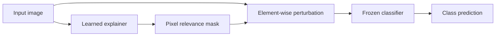

# Learned Perturbation for Explainable Image Classification

A reproducible modernization of my Computer Science research on **Explainable Artificial Intelligence (XAI)** for image classifiers.

The original work investigated whether a learnable network placed before a trained image classifier could produce a **pixel-level relevance mask** while preserving the classifier's ability to predict the correct class. The experiments used VGG19-based image classification and Food-101-derived subsets.

> This repository modernization preserves the research method. It improves reproducibility, code structure, checkpointing, and experimental controls without presenting new results as if they belonged to the original study.

## Research idea



For an input image `x`, the explainer learns a mask `m(x)` constrained to `[0, 1]` by a sigmoid output. The classifier receives the perturbed image:

```text
x' = x ⊙ m(x)
```

Training updates the **explainer only**. The classifier is kept frozen.

## What is preserved from the original research

- VGG19-BN as the image-classification backbone.
- A learned pre-classifier perturbation stage.
- The original dense pixel-mask explainer:
  - flatten `3 × 224 × 224`
  - fully connected hidden layer
  - sigmoid relevance mask
  - element-wise image perturbation
- Experiments on reduced Food-101-derived class sets.
- The option to train the explainer only on samples already classified correctly.

The original thesis PDF is preserved in [`docs/Proposal of a new explainability method.pdf`](docs/Proposal%20of%20a%20new%20explainability%20method.pdf).

## What is modernized

### Reproducible project structure

The original implementation mixed dataset preparation, training, filtering, visualization, Google Drive paths, and model serialization in one Colab-derived Python file. These responsibilities are now separated.

```text
.
├── scripts/
│   ├── train_classifier.py
│   └── train_explainer.py
├── src/xai_perturbation/
│   ├── checkpoints.py
│   ├── config.py
│   ├── data.py
│   ├── evaluation.py
│   ├── explanations.py
│   ├── models.py
│   └── training.py
├── tests/
├── pyproject.toml
└── README.md
```

### Current TorchVision model API

The classifier uses the weights API rather than the deprecated `pretrained=True` argument:

```python
weights = VGG19_BN_Weights.DEFAULT
model = vgg19_bn(weights=weights)
```

### Portable checkpoints

Instead of pickling complete model objects, checkpoints contain a `state_dict` and experiment metadata. Loading uses `weights_only=True`.

### Deterministic dataset splitting

Train/evaluation/test splits accept an explicit random seed rather than depending on the state of a Colab session.

### Non-destructive filtering

The original workflow physically removed or exported dataset examples during some preparation steps. The new implementation represents correctly-classified examples as a `Subset`, leaving the underlying dataset unchanged.

### Frozen classifier behavior

The classifier is not only excluded from the optimizer: its parameters have `requires_grad=False` and it remains in evaluation mode while the explainer trains. This prevents classifier BatchNorm/Dropout state from drifting during explanation training.

## Important methodological note: correctly classified subsets

The original study included experiments where the explainer was trained/evaluated on samples the classifier already predicted correctly. This can be useful when asking:

> “What information does this already-correct classifier rely on?”

However, selecting data based on classifier correctness changes the evaluated population and can introduce **selection bias**. The modernization therefore makes this behavior explicit:

```bash
python scripts/train_explainer.py DATASET CLASSIFIER.pt --correct-only
```

It is **off by default** and should be reported whenever used.

## Preprocessing

Two preprocessing modes are intentionally kept distinct:

- `legacy` — resize, center crop, tensor conversion; reproduces the original experimental code.
- `vgg` — preprocessing associated with the pretrained VGG19-BN weights.

For strict comparison with the original experiments, use `legacy`. For new experiments, preprocessing must be declared as part of the experimental configuration.

## Setup

Requirements: Python 3.11+.

```bash
python -m venv .venv
source .venv/bin/activate        # macOS/Linux
# .venv\Scripts\activate       # Windows

pip install -e ".[dev]"
```

## Train a classifier

The dataset is expected in TorchVision `ImageFolder` layout:

```text
dataset/
├── class_a/
├── class_b/
└── ...
```

Then:

```bash
python scripts/train_classifier.py dataset/ \
  --output checkpoints/classifier.pt \
  --epochs 5 \
  --preprocessing legacy
```

## Train the explainer

```bash
python scripts/train_explainer.py \
  dataset/ \
  checkpoints/classifier.pt \
  --output checkpoints/explainer.pt \
  --epochs 4
```

To reproduce the correctly-classified-only experimental condition:

```bash
python scripts/train_explainer.py \
  dataset/ \
  checkpoints/classifier.pt \
  --correct-only
```

## Quality checks

```bash
ruff check .
pytest -q
```

Tests use tiny synthetic tensors and do **not** download VGG19 weights or Food-101.

## Research status

The thesis reported experimental consistency in generated relevance maps and identified changes required for improving explanation quality. The modernization does not fabricate or reinterpret those results.

Before this project becomes a standalone portfolio repository, the next research pass should add:

- machine-readable experiment configurations
- reconstruction of the exact class subsets used in the thesis
- saved original metrics where they can be verified from source material
- quantitative explanation metrics (for example deletion/insertion-style evaluation)
- comparison against established XAI baselines
- representative relevance-map figures
- multiple random seeds and uncertainty reporting
- hardware/runtime documentation

## Original research artifact

The thesis PDF, **Proposal of a new explainability method**, is preserved in [`docs/`](docs/) alongside the maintained research implementation.
